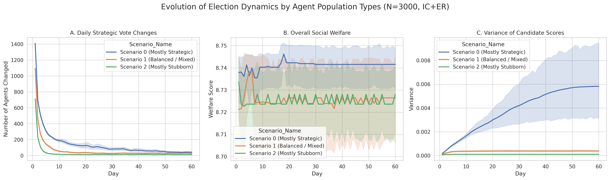
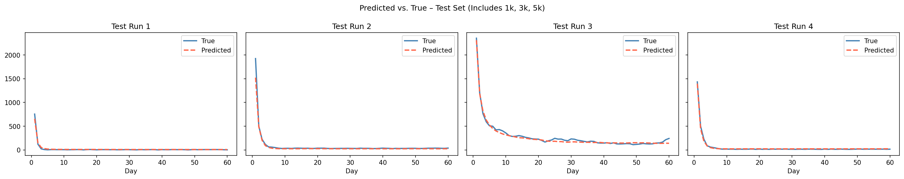
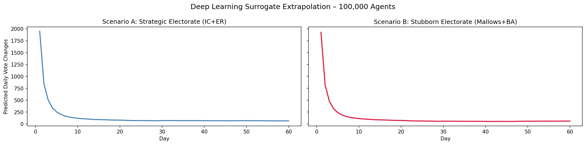

# Surrogate Modeling of Strategic Voting Dynamics at National Scale

## Project Overview
This repository contains the final project for the Advanced Topics in AI (ATAI) course at Université Toulouse Capitole. The project explores the effects of strategic voting in a multi-candidate election (based on the 12 candidates of the 2022 French Presidential Election) using Agent-Based Modeling (ABM) and Deep Learning. 

Our goal is to model how voters rationally abandon their sincere preferences for a candidate with a better chance of winning, driven by polling information shared across a social network. To overcome the computational limits of running ABMs for large populations, we built a Deep Learning surrogate model capable of predicting election dynamics at a national scale.

**Authors:** Mintesnot Nigusu Yimer, Hritik Bikram Rawal, Florence Angel Ayyala

---

## Repository Structure & Methodology

The repository is structured to reflect the four main phases of our methodology:

### Part 1: Data Generation
* 📄 **[part1_preferences_and_network.py](Data_Generation/part1_preferences_and_network_py.py)**: A Python script using `preflibtools` and `networkx` to generate the initial conditions for the simulation. It generates voter preferences using Impartial Culture (IC) and Mallows models, and constructs voter social networks using Erdős-Rényi (ER) and Barabási-Albert (BA) graphs.

### Part 2: Agent-Based Simulation
* 📄 **[election.gaml](Simulation/election.gaml)**: The GAMA platform simulation code. It simulates a 60-day election cycle where agents react to daily polls based on their Nash equilibrium calculations. The model tracks social welfare, the variance of the candidate scores, and the number of strategic opinion changes per day.

### Part 3: Deep Learning Surrogate Model
* 📄 **[Surrogate_model.ipynb](Surrogate_Model/Surrogate_model.ipynb)**: A Jupyter Notebook containing the data preprocessing and the TensorFlow/Keras implementation of a Bidirectional Long Short-Term Memory (BiLSTM) neural network. It trains on the GAMA time-series data to rapidly predict daily vote changes.
* 📊 **[surrogate_training_data_FINAL.csv](Dataset/surrogate_training_data_FINAL.csv)**: The core dataset exported from GAMA used to train the surrogate model, stored in the `Dataset` folder.

### Part 4: Analysis & Reporting
* 📄 **[plotforGamaResult.ipynb](Analysis_and_Report/plotforGamaResult.ipynb)**: A Jupyter Notebook used to plot and visualize the outputs of the GAMA simulations and compare them against the surrogate model's predictions.
* 📕 **[Report.pdf](Analysis_and_Report/Report.pdf)**: The final academic paper formatted in the ACM double-column template, detailing the game theory formalization, simulation setup, surrogate model architecture, and discussions on scalability.

---

## Results & Visualizations

### 1. GAMA Simulation: Multi-Agent Dynamics
The Agent-Based Model captures the collapse of third-party candidates as voters strategically shift their votes. The plots below show how the distribution of agent types (Stubborn vs. Strategic) affects score variance, social welfare, and daily vote changes over the 60-day election cycle.



### 2. BiLSTM Surrogate Model Accuracy
To bypass the computational bottleneck of simulating thousands of interacting agents, we trained a BiLSTM neural network. As shown below, the surrogate model successfully learned the underlying game-theoretic dynamics, accurately predicting the daily volume of strategic vote changes on unseen test data.



### 3. Scaling to 100,000 Voters
The ultimate goal of the surrogate model is scalability. Running the GAMA simulation for massive populations is computationally prohibitive. Using our trained neural network, we successfully extrapolated the election dynamics to a national scale of 100,000 voters, running thousands of times faster than traditional ABM.



---

## Prerequisites & Installation

1. **Python 3.x:** Required for data generation and Jupyter Notebooks.
2. **GAMA Platform:** Required to run the Agent-Based Model.
3. **Required Python Libraries:**
   ```bash
   pip install pandas numpy matplotlib seaborn scikit-learn tensorflow joblib preflibtools networkx
